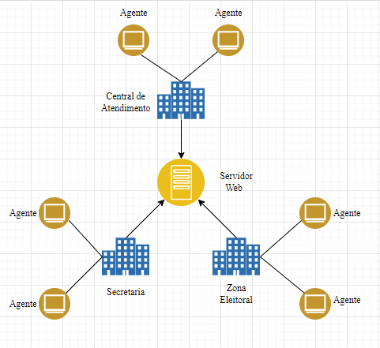

<!DOCTYPE html>
<html lan="pt-br">
    <head>
        <meta charset="utf-8">
    </head>
    <body>
        

            <h1>AGENTE SESOP</h1>
        

        <h3>OBJETIVOS</h3>
        
- Visualização de todas as impressoras conectadas na rede e no micro

        
- Visualização de todos os computadores conectados na rede

        
- Criação de um programa como serviço no windows

        
- Criação de um servidor web

        
- Configurador de impressoras fisicas

        
- Reconfigurador de computadores para emprestimo

        

        <h3>TECNOLOGIAS</h3>
        
- Python

        <h3>BIBLIOTECAS</h3>
        
- Subprocess

        
- Tkinter

        <h3>FRAMEWORKS</h3>
        
- FastAPI

        

        

            <h3>ARQUITETURA DE SISTEMA<h3>
            
        

        

    </body>
</html>
